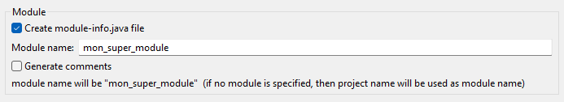
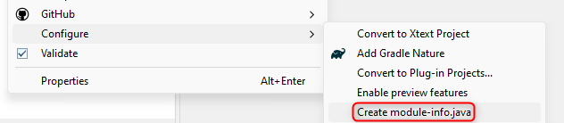
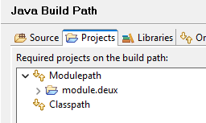

# TD n°1 - Reflection / Annotations / Modules

Ce premier TD a pour objectif de vous familiariser avec les concepts abordés en cours.
Nous allons pour celà écrire une méthode qui sérialise n'importe quel instance java
en [JSON](https://www.json.org/json-fr.html).

## Ce qu'on veut obtenir

```java
static class Bean {
	public String getProperty() { return "value"; }
}

static class SampleClass {
	public Boolean getBoolean() { return Boolean.TRUE; }
	public String getString() { return "xoxo"; }
	public Integer getInteger() { return 42; }
	public Object[] getArray() { 
		return new Object[] { null, new Bean(), 3.14d };
	}
}

System.out.println(new Json().write(new SampleClass()));
```

```json
{
  "string": "xoxo",
  "array": [
    null,
    { "property": "value" },
    3.14
  ],
  "integer": 42,
  "boolean": true
}
```

⚠️ L'ordre des propriétés peut varier.

## Reflection

Dans cette première partie, nous allons explorer les possibilités offertes par la « reflection ».
Utilisez la classe `Json` comme base de travail.

```java
public class Json {

	public String write(Object instance) {
		// TODO générer ici la représentation json de instance
		return null;
	}

}
```

**🚧 Ecrivez une première implémentation de la méthode write qui sérialise uniquement les nombres.**

```java
new Json().write(42);		// 42
new Json().write(3.14f);	// 3.14
```

**🚧 Refactorez votre code si besoin, et étoffez le pour gérer tous les types attendus.**

Veuillez à respecter les indications suivantes :
* La méthode `write()` doit pouvoir sérialiser `null`, les types simples `short`, `int`, `long`, `float`, `double`, `boolean`, 
  et `String`, ainsi que les objets et les tableaux d'un des types précédemment cités.
  * exemple : `[2, {"a": "b"}, 5.3, [true]]`
* Pour les objets, les propriétés à sérialiser sont déterminées par les _getters_
  * un _getter_ est une méthode sans argument dont le nom commence par "get"
  * exemple : `getProp()` donne la valeur de la propriété "prop"
* Les propriétés des objets JSON doivent être représentées en convention _snake case_ (voir `CaseUtils`)

💡 Pour les objets, vous n'êtes pas obligés de gérer l'héritage, uniquement les getters « déclarés » dans l'instance fournie.

**Quelques conseils** :

* Travaillez de manière itérative, et construisez des cas de tests à chaque étape
* La méthode `getClass()` appelée sur une instance permet de récupérer sa `Class` (i.e. sa définition)
* Une instance de `Class<X>` permet de lister les méthodes, les propriétés, ... défini(e)s par la classe X.
* La méthode `Class::isAssignableFrom()` devrait vous être utile, l'operateur `instanceof` également
* Le type des éléments d'un tableau est obtenu avec la méthode `Class::getComponentType()`,
  cette méthode renvoie `null` si la classe n'a pas le type tableau.
* Les `streams` c'est stylé !

## Annotations

Nous allons améliorer notre librairie en ajoutant des options permettant d'affiner la transformation en JSON.
**🚧 Créez une annotation `@JsonIgnore` qui ne peut s'appliquer
que sur un _getter_, et indique de ne pas sérialiser la propriété associée. Modifiez votre classe `Json`
pour la prendre en compte.**

```java
    @JsonIgnore
    public String getIgnore() { return "ignore me !"; }
    // la propriété "ignore" ne fera pas partie du json résultant
```

<span style="color: darkblue; font-weight: bold;">Créez une seconde annotation `@JsonProperty` qui permet de renommer
une propriété lors de la (dé)sérialisation. Elle doit prendre en paramètre le nouveau nom de la propriété.</span>

```java
    @JsonProperty("hello")
    public String getProperty() { return "world"; }
    // génèrera le flux json « "hello": "world" »
```

## Modules (🏠)

Nous allons éclater notre projet en 3 modules :
* `module.helpers` va conserver les classes utilitaires (`CaseUtils`)
* `module.lib` va constituer notre librairie de sérialisation json (`Json`)
* `module.test` va contenir une classe de test pour notre librairie

Au niveau des dépendances, on va donc avoir : 
```
  ┌─────────────┐           ┌────────────┐           ┌────────────────┐  
  │ module.test ├──utilise─►│ module.lib ├──utilise─►│ module.helpers │  
  └─────────────┘           └────────────┘           └────────────────┘  
```

**🚧 Ecrivez les fichiers `module-info.java` qui vont bien pour chaque module.**

L'intégration des modules dans Java remonte à quelques années maintenant (sept. 2017)
et pourtant les IDEs ne sont pas toujours très copain avec. Les paragraphes suivants
vous donnent quelques piste pour vous [dépatouiller](https://fr.wiktionary.org/wiki/dépatouiller)
avec vos IDEs préférés.

### Eclipse

Avec Eclipse, chaque module doit se situer dans son propre projet.

Pour créer un module, initialisez un projet de type "Java Project". Par soucis de simplicité, utilisez
le nom du module comme nom de projet, et cochez la case "Create module-info.java file":



Si vous oubliez de cocher, vous pouvez toujours ajouter le `module-info.java` ultérieurement par un clic droit sur le projet.



Si un module a une dépendance sur un autre (_requires_), il faut mettre à jour son _build path_ manuellement.
Exemple : le module `module.un` a besoin d'un package du module `module.deux`, il faut ajouter `module.deux`
dans la liste des modules du _build path_.



Une fois ces manipulations effectuées, vous devriez pouvoir lancer votre application de test sans soucis.

### VsCode

VsCode ne sait pas vraiment gérer les modules mais peut utiliser les méta-données Eclipse
des projets Java. On va donc "tricher" en ajoutant un fichier `.project` et un `.classpath`
à nos projets pour qu'ils soient correctement gérés.

Dans chaque répertoire de module, créez un fichier `.projet` contenant le nom du module :

```xml
<?xml version="1.0" encoding="UTF-8"?>
<projectDescription>
	<name>nom du projet ici (utiliser le nom du répertoire)</name>
	<comment></comment>
	<projects>
	</projects>
	<buildSpec>
		<buildCommand>
			<name>org.eclipse.jdt.core.javabuilder</name>
			<arguments>
			</arguments>
		</buildCommand>
	</buildSpec>
	<natures>
		<nature>org.eclipse.jdt.core.javanature</nature>
	</natures>
</projectDescription>
```

Créez également un fichier `.classpath` comme suit 👇.

```xml
<?xml version="1.0" encoding="UTF-8"?>
<classpath>
	<classpathentry kind="src" path="src"/>
	<classpathentry kind="output" path="bin"/>
	<!-- vous pouvez ajuster la version de Java en modifiant l'identifiant `JavaSE-21` ci-dessous -->
	<classpathentry kind="con" path="org.eclipse.jdt.launching.JRE_CONTAINER/org.eclipse.jdt.internal.debug.ui.launcher.StandardVMType/JavaSE-21"/>
</classpath>
```

Pour les modules qui dépendent d'autres modules (_requires_), vous devrez rajoutez une section
permttant à java de savoir où aller chercher ces dépendances. Pour chacun, ajouter une section
`<classpathentry/> comme ci-dessous 👇 en ajustant le chemin vers le module requis.

```xml
    <classpathentry combineaccessrules="false" kind="src" path="/chemin vers le module requis">
        <attributes>
            <attribute name="module" value="true"/>
        </attributes>
    </classpathentry>
```

Vous devriez ensuite pouvoir exécuter votre application depuis VsCode.

### Lancement manuel

Si vous n'arrivez pas à configurer votre IDE, vous pouvez utiliser la ligne de commande.

> As per JEP 261 the --module-source-path option (for compilation in "multi-module mode")
> must point to a directory that holds one subdirectory for each contained module,
> where the directory name must equal the module name.

> To accommodate layouts where sources are not directly contained in the module directory,
> the option supports patterns where the token * can be used to represent the module name
> in any part of the path such as in "./*/src/main/java/", which will find the module
> my.mod1 in ./my.mod1/src/main/java/module-info.java etc.

> JEP 261 does not mention any contraints on where in the pattern * may occur, but apparently
> javac doesn't like patterns starting with *. This may or may not be intentional.

```bash
# commande à exécuter dans le répertoire racine qui stocke les modules
# on utilise des simples quotes pour éviter la résolution par le shell
% javac -d bin --module-source-path './*/src' $(find . -name "*.java")
% java --module-path bin -m module/package.ClasseContenantLeMain
```
