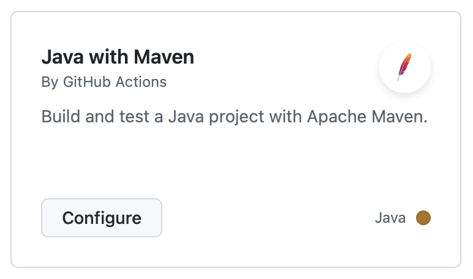
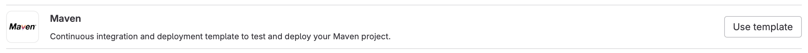
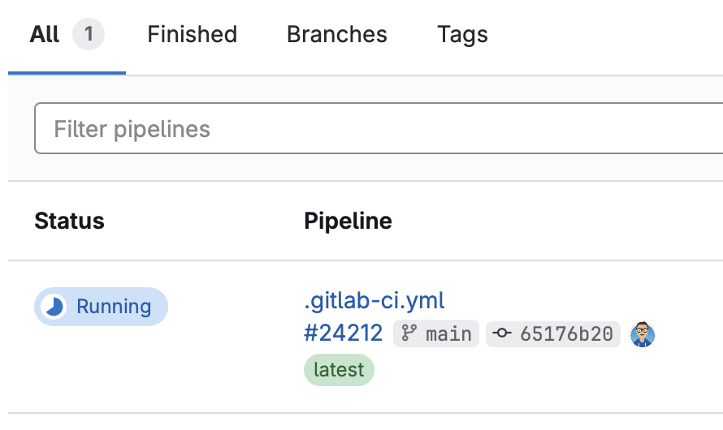

# TD n°3 - Maven

Amis dresseurs, aujourd'hui nous allons capturer des Pokemons !

## Maven

🚧 **Créez un projet maven « vide »**, c'est-à-dire un répertoire contenant un fichier `pom.xml` avec les coordonnées du projet,
et la structure "strandard" des répertoires. Vous pouvez éventuellement vous aider de l'archetype
[Maven Simple Project](https://maven.apache.org/archetypes/maven-archetype-simple/).

> L'archetype maven permet de créer un projet maven prêt à l'emploi.
> ```bash
> $ mvn archetype:generate -DarchetypeGroupId=org.apache.maven.archetypes \
>   -DarchetypeArtifactId=maven-archetype-simple -DarchetypeVersion=1.5
> Define value for property 'groupId':
> Define value for property 'artifactId':
> ...
> ```
> Cette commande crée un répertoire nommé d'après l'`artifactId`.
> Il contient le `pom.xml`, un fichier java qui affiche "Hello World!"
> et un squelette de test unitaire.

Commençons par récupérer [la liste de tous les pokemons](https://www.data.gouv.fr/fr/datasets/pokemon/).
Les données étant stockées sous forme d'un fichier csv, il faudra une librairie pour les extraire.
Nous allons pour cela utiliser une librairie « Apache Commons ». Ajoutez la dépendance vers
`org.apache.commons:commons-csv` dans sa dernière version.

> Il faut aller chercher la version dans le [Maven Central](https://search.maven.org).
> Actuellement (21 sept. 2024), on en est à la version 1.12.0.

🚧 **Implémentez la classe `PokemonRegistry`** en vous aidant du `PokemonBuilder` :

```java
import java.util.Collections;

public class PokemonRegistry {    
    public List<Pokemon> fetch() throws Exception {
        // TODO implémenter cette méthode en utilisant le builder pour construire les instances 👇
        // final Pokemon p = PokemonBuilder.newPokemon().setNom(...).setPv(...).setType(...).build();
        return Collections.emptyList();
    }
}
```

🚧 **Créez une classe `PrintEmAll` qui va afficher le nom, le nombre de pts de vie et le type des 10 premiers éléments de la liste**.

💡 [Documentation de la librairie](https://commons.apache.org/proper/commons-csv/apidocs/index.html)

> ```java
> new PokemonRegistry().fetch().stream().limit(10).forEach((p) -> {
>   System.out.println(p.getNom() + " (" + p.getPv() + ")  -  " + p.getType());
> });
> ```

Il semble y avoir une erreur dans l'extraction. Ajoutons des TUs pour vérifier notre code.

## Junit

🚧 **Ajoutez la dépendance sur JUnit 5 (i.e. `org.junit.jupiter:junit-jupiter-engine:5.11.2`).
Exécutez les tests et vérifiez qu'ils passent sans erreur**.

🚧 **Les tests fournis ne font pas grand chose. Dans `PokemonBuilderTest`, ajoutez une méthode permettant de créer un pokemon
avec toutes ses caractériques et vérifiez le résultat. Profitez-en pour corriger le _builder_**.

> Les appels à `setNom()` et `setType()` sont inversés dans le builder.

🚧 **Ajoutez quelques tests dans `PokemonRegistryTest`**. Par exemple, la registry doit contenir 800 pokemons,
le premier doit s'appeler "Bulbasaur" (#1) et le dernier "Volcanion" (#720).

💡 [Assertions les plus courantes de JUnit5](https://medium.com/javarevisited/junit-5-assertions-5d360545e3a).

🚧 L'exécution _systématique_ des TUs n'est pas pertinente. **Désactivez l'exécution des tests
(il suffit pour cela de positionner la propriété `maven.test.skip` à `false`)
et ajoutez un profile qui permet de les résactiver à la demande**.

```bash
# réactivation des tests unitaires à la demande
$ mvn clean package -P run-unit-tests
```

> ```
> <properties>
>   <maven.test.skip>true</maven.test.skip>
>   <!-- ... -->
> </properties>
>
> <profiles>
>   <profile>
>     <id>run-unit-tests</id>
>     <properties>
>       <maven.test.skip>false</maven.test.skip>
>     </properties>
>   </profile>
> </profiles>
> ```

💡 Vous pouvez voir les profiles actifs avec la commande `mvn help:active-profiles`.

## Paramétrisation

Notre application est fonctionnelle, mais pas encore prête à être déployée à grande échelle.
L'adresse du service pourrait changer, il faudrait donc qu'elle soit paramétrable.

🚧 **Créez une ressource `configuration.properties`, et modifiez votre `main()`
pour récupérer l'adresse du webservice depuis ce fichier**.

```properties
# configuration.properties
endpoint=http://xxx
```

```java
final Properties appProps = new Properties();
try(final InputStream inputStream = getClass().getResourceAsStream("/configuration.properties")) {
    appProps.load(inputStream);

    final String endpointURl = appProps.get("endpoint").toString();
    // ...
    
} catch(IOException e) {
    e.printStackTrace(System.err);
}
```

Allons un cran plus loin en externalisant cette adresse dans le `pom.xml`.

🚧 **Créez une _property_ maven que vous utiliserez dans le fichier `configuration.properties`,
et activez le filtrage des ressources pour la remplacer pendant la compilation**.

```properties
# configuration.properties
endpoint=${csv.endpoint}
```

```xml
<build>
  <resources>
    <resource>
      <directory>src/main/resources</directory>
      <filtering>true</filtering>
    </resource>
  </resources>
  <!-- ... -->
</build>
```

## Packaging

On veut générer une version _standalone_ de notre application (i.e. un `.jar` utilisable par n'importe qui).
Et pour faciliter sa diffusion, on va l'empaqueter dans un fichier zip avec un _readme_ qui explique comment s'en servir.

Notre projet étant simple, les valeurs par défaut du `pom.xml` permettent de générer
notre application sous la forme d'un `.jar` dans le répertoire `./target`.

```bash
$ mvn clean package
# le .jar sera généré dans le répertoire ./target
```

Le build affiche de nombreux warnings, [corrigez les](https://maven.apache.org/plugins/maven-resources-plugin/examples/encoding.html).
```
[WARNING] File encoding has not been set, using platform encoding UTF-8, i.e. build is platform dependent!
````

🚧 **Générez votre application et testez la**. 

```bash
$ mvn clean package
$ (cd ./target && java -jar pokemons.jar)
```

🤔 Que signifie le message d'erreur obtenu ?

> ```bash
> $ (cd ./target && java -jar pokemons.jar)
> aucun attribut manifest principal dans pokemons.jar
> ```
> L'application est en erreur parce que le `.jar` n'est pas « exécutable ».
> Il faut renseigner le nom de la classe contenant le `main` dans le manifest.

Nous allons corriger l'erreur et en profiter pour déplacer le `.jar` dans un répertoire spécifique
(`./target/dist`) afin de faciliter la création de l'archive finale.

🚧 **Reconfigurez le plugin [maven-jar-plugin](https://maven.apache.org/shared/maven-archiver/index.html)
et regénérez votre application**.

```xml
<plugin>
    <artifactId>maven-jar-plugin</artifactId>
    <version>3.4.2</version>
    <configuration>
        <archive>  
        <manifest>
            <mainClass>...</mainClass>
        </manifest>
        </archive>
        <outputDirectory>...</outputDirectory>
    </configuration>
</plugin>
```

💡 [Variables prédéfinies utilisables dans un pom.xml](https://books.sonatype.com/mvnref-book/reference/resource-filtering-sect-properties.html)

🚧 **Reconstruisez votre livrable et exécutez à nouveau votre application**.

🤔 Pourquoi est-elle toujours en erreur ?

> ```
> $ (cd ./target/dist && java -jar pokemons.jar)
> Exception in thread "main" java.lang.NoClassDefFoundError: org/apache/commons/csv/CSVFormat
>     at pokemon.PokemonRegistry.fetch(PokemonRegistry.java:18)
>     at PrintEmAll.main(PrintEmAll.java:6)
> ```
> Il manque les dépendances (celles déclarées dans le `pom.xml`).

Le plugin [`dependency`](https://maven.apache.org/plugins/maven-dependency-plugin/examples/copying-project-dependencies.html)
va nous être utile. Un de ses `goals` permet de récupérer les dépendances déclarées dans le `pom.xml`.
Il est lié par défaut à la phase `package`.

```xml
<plugin>
    <artifactId>maven-dependency-plugin</artifactId>
    <version>3.8.1</version>
    <executions>
        <execution>
        <id>copy-dependencies</id>
        <phase>package</phase>
        <goals>
            <goal>copy-dependencies</goal>
        </goals>
        <configuration>
            <outputDirectory>${project.build.directory}/dist</outputDirectory>
            <overWriteIfNewer>true</overWriteIfNewer>
        </configuration>
        </execution>
    </executions>
</plugin>
```

🚧 **Reconstruisez votre application**. Le répertoire `./target/dist` contient désormais beaucoup trop de choses :

```
apiguardian-api-1.1.2.jar
commons-codec-1.17.1.jar
commons-csv-1.12.0.jar
commons-io-2.17.0.jar
junit-jupiter-api-5.11.2.jar
...
```

🚧 Par défaut, le plugin `dependency` copie toutes les dépendances. **Utilisez la propriété
[`includeScope`](https://maven.apache.org/plugins/maven-dependency-plugin/copy-dependencies-mojo.html#includeScope)
pour n'importer que les librairies indispensables, et copiez les dans le sous-répertoire `./lib`**.

```xml
<outputDirectory>${project.build.directory}/dist/lib</outputDirectory>
<includeScope>runtime</includeScope>
```

Votre répertoire `./target/dist` devrait désormais ressembler à ça :

```
xxx.jar
lib/
  apiguardian-api-1.1.2.jar
  commons-codec-1.17.1.jar
  commons-csv-1.12.0.jar
  commons-io-2.17.0.jar
  junit-jupiter-api-5.11.2.jar
```

Mais votre application ne fonctionnera toujours pas, il faut lui dire où trouver ses dépendances.
Ajouter les lignes suivantes au `maven-jar-plugin` :
```xml
<addClasspath>true</addClasspath>
<classpathPrefix>lib/</classpathPrefix>
```

🚧 **Reconstruisez et exécutez votrez application**, qui cette fois devrait fonctionner.

```bash
$ (cd target/dist && java -jar pokemons.jar)
Bulbasaur (45)  -  Grass
Ivysaur (60)  -  Grass
Venusaur (80)  -  Grass
VenusaurMega Venusaur (80)  -  Grass
...
```

Notre application est fonctionnelle \0/ mais présente bien peu d'intérêt.
On va la rendre plus intéressante en la transformant en un moteur de recherche.

🚧 **Ajoutez une dépendance sur [`picocli`](https://picocli.info)**.

```xml
<dependency>
    <groupId>info.picocli</groupId>
    <artifactId>picocli</artifactId>
    <version>4.7.6</version>
</dependency>
```

🚧 En vous inspirant de [la doc](https://picocli.info/#_example_application),
**créez une classe `CatchEmAll` qui permet d'effectuer une recherche par nom (partiel)**.
Vous devrez modifier la configuration des plugins dans le `pom.xml`
pour ajuster la construction de l'archive finale.

```bash
$ (cd target/dist && java -jar pokemons.jar)
Missing required parameter: '<filter>'
Usage: find <filter>
Search pokemons by (partial) name
      <filter>   Search filter
```

Maintenant qu'on a une véritable application, la classe `PrintEmAll`
n'est plus d'un grand intérêt et ne devrait pas terminer dans le livrable final.

🚧 **Utilisez le plugin `clean` pour le supprimer avant la création de l'archive finale**.
Vérifier sa bonne exécution en étudiant le log généré par maven.

> ```
> [INFO] --- clean:3.4.0:clean (remove-useless-classes) @ pokemons ---
> [INFO] Deleting /Users/jay/Workspace/td-numero-trois/target/classes (includes = [PrintEmAll.class], excludes = [])
> ```

🤔 Quelle est la bonne [phase](https://maven.apache.org/guides/introduction/introduction-to-the-lifecycle.html) pour le faire ?

> On peut par exemple utiliser la phase `prepare-package` :
> « perform any operations necessary to prepare a package before the actual packaging. » 

```bash
$ (cd target/dist && java -jar pokemons.jar bul)
Bulbasaur (45) [Grass]
Snubbull (60) [Fairy]
Granbull (90) [Fairy]
```

Pour que notre application soir parfaite, il nous manque le _readme_.
Nous allons détourner le plugin `resources` pour le copier au bon endroit.

```xml
<plugin>
    <artifactId>maven-resources-plugin</artifactId>
    <version>3.3.1</version>
    <executions>
        <execution>
        <id>copy-readme</id>
        <phase>prepare-package</phase>
        <goals>
            <goal>copy-resources</goal>
        </goals>
        <configuration>
            <outputDirectory>${project.build.directory}/dist</outputDirectory>
            <resources>          
            <resource>
                <filtering>false</filtering>
                <directory>src</directory>
                <includes>
                    <include>readme.txt</include>
                </includes>
            </resource>
            </resources>              
        </configuration>            
        </execution>
    </executions>
</plugin>
```

🤔 Remarquez lors du build que le plugin est exécuté plusieurs fois, pourquoi ?

> La plugin `resources` est exécuté par défaut deux fois : une fois avant la compilation des sources (phase `process-resources`),
> et une fois avant la compilation des tests (phase `process-test-resources`).
> On a ajouté une troisième exécution lors de la phase `prepare-package`.
> ````
> [INFO] --- resources:3.3.1:copy-resources (copy-readme) @ pokemons ---
> ```

Il ne reste plus qu'à produire une archive zip de notre répetoire. Nous allons pour cela
invoquer le plugin [`assembly`](https://maven.apache.org/plugins/maven-assembly-plugin/)
qui utilise un fichier de description de l'archive à générer.

```xml
<plugin>
    <groupId>org.apache.maven.plugins</groupId>
    <artifactId>maven-assembly-plugin</artifactId>
    <version>2.2</version>
    <executions>
        <execution>
        <id>archive-zip</id>
        <phase>package</phase>
        <goals>
            <goal>single</goal>
        </goals>
        </execution>
    </executions>
    <configuration>
        <finalName>pokemons-release</finalName>
        <outputDirectory>./dist</outputDirectory>
        <appendAssemblyId>false</appendAssemblyId>
        <descriptors>
        <descriptor>${basedir}/src/dist.xml</descriptor>
        </descriptors>
    </configuration>
</plugin>
```

🚧 **Créez le fichier `src/dist.xml`**.

```xml
<assembly
	xmlns="http://maven.apache.org/plugins/maven-assembly-plugin/assembly/1.1.2"
	xmlns:xsi="http://www.w3.org/2001/XMLSchema-instance"
	xsi:schemaLocation="http://maven.apache.org/plugins/maven-assembly-plugin/assembly/1.1.2 http://maven.apache.org/xsd/assembly-1.1.2.xsd">
	<id>livrable_final</id>
	<formats>
		<format>zip</format>
	</formats>
	<includeBaseDirectory>false</includeBaseDirectory>
	<fileSets>
		<fileSet>
			<directory>target/dist/</directory>
			<outputDirectory>/</outputDirectory>
			<lineEnding>unix</lineEnding>
			<includes>
				<include>**</include>
			</includes>
		</fileSet>
	</fileSets>
</assembly>
```

🚧 **Vérifiez que le livrable final est correct** : il est bien créé dans le répertoire `./dist`
à la racine de votre projet, et son contenu est « bien comme il faut ».

Dernier point, puisqu'elle est en dehors du répertoire `./target`, votre archive zip
n'est par défaut pas supprimée par le plugin `clean`. Nos allons y remédier. 

🚧 **Consultez la [documentation](https://maven.apache.org/plugins/maven-clean-plugin/index.html) du plugin
et trouvez comment supprimer le répertoire `./dist`**.

> Il suffit d'aller dans la section « Delete Additional Files » dans le menu sur la gauche.
> ```xml
> <plugin>
>     <artifactId>maven-clean-plugin</artifactId>
>     <version>3.4.0</version>
>     <configuration>
>         <filesets>
>         <fileset>
>             <directory>./dist</directory>
>         </fileset>
>         </filesets>
>     </configuration>
> </plugin>

## CI/CD (🏆)

**Pré-requis** : un compte [Github](https://github.com) ou [GitLab](https://gitlab.univ-lorraine.fr).

### GitHub

Créer un _repository_ « Public » (pour bénéficier des _workers_ gratuits) et y _pusher_ votre projet local.

Créer une action de type "Java with Maven".


Commitez le fichier généré et retournez dans la section "Actions" pour consultez le log de construction.
Il sera probablement en erreur.

```
Error:  Source option 5 is no longer supported. Use 7 or later.
Error:  Target option 5 is no longer supported. Use 7 or later.
```

Corrigez l'erreur et relancez un build.

> ```xml
>  <properties>
>    <maven.compiler.source>17</maven.compiler.source>
>    <maven.compiler.target>17</maven.compiler.target>
>  </properties>
> ```
>
> ```
> [INFO] Building jar: /home/runner/work/scaling-rotary-phone/scaling-rotary-phone/target/demo.jar
> [INFO] ------------------------------------------------------------------------
> [INFO] BUILD SUCCESS
> [INFO] ------------------------------------------------------------------------
> [INFO] Total time:  8.533 s
> [INFO] Finished at: 2024-10-09T12:30:36Z
> [INFO] ------------------------------------------------------------------------
> ```

### GitLab

Créer un _repository_ pour y _pusher_ votre projet local.

Ajoutez un fichier `ci_settings.xml` à la racine de votre projet :
```xml
<settings xmlns="http://maven.apache.org/SETTINGS/1.1.0" xmlns:xsi="http://www.w3.org/2001/XMLSchema-instance"
  xsi:schemaLocation="http://maven.apache.org/SETTINGS/1.1.0 http://maven.apache.org/xsd/settings-1.1.0.xsd">
  <servers>
    <server>
      <id>gitlab-maven</id>
      <configuration>
        <httpHeaders>
          <property>
            <name>Job-Token</name>
            <value>${CI_JOB_TOKEN}</value>
          </property>
        </httpHeaders>
      </configuration>
    </server>
  </servers>
</settings>
```

Depuis l'interace web, dans la section « 🚀 Build », créez un nouveau pipeline en utilisant le template maven.


Changez l'image docker `maven:3-openjdk-8` pour une plus récente comme `maven:3-openjdk-17`
(vous pouvez en profiter pour remplacer les occurence de `jdk8` par `jdk17`^^) et commitez le fichier.
Le _build_ doit se lancer automatiquement.



Si tout va bien, il doit se terminer sur le statut "Passed".


