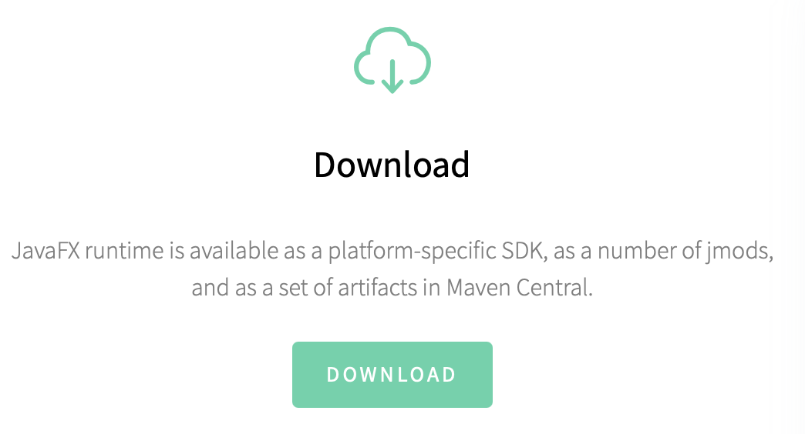
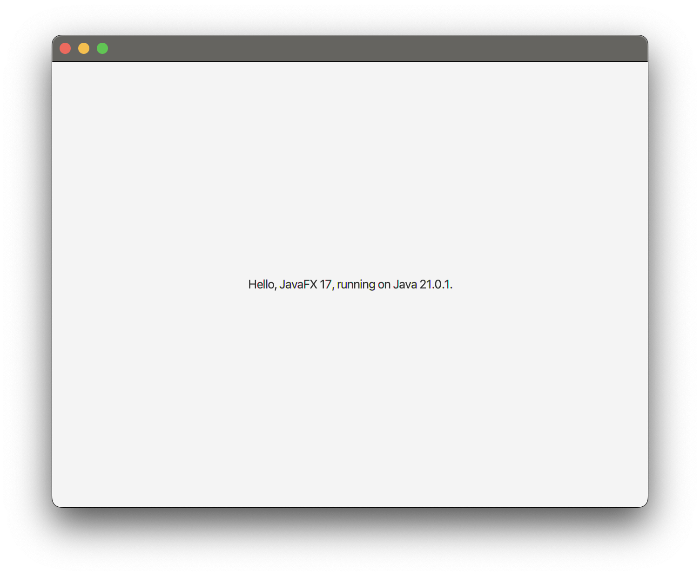

# TD n°4 - JavaFX

Découvrir la programmation graphique avec JavaFX.

## Runtime Java FX

Pour installer le kit de développement JavaFX (SDK), il faut le télécharger depuis
la page d'accueil du [site officiel](https://openjfx.io).



Sélectionnez une version récente adaptée à votre jdk (la version 23 de septembre 2024
pour Windows x64 devrait faire l'affaire pour le plus grand nombre).

Une fois l'archive dézippée dans le répertoire de votre choix, 
[suivez scrupuleusement les étapes décrites dans la doc](https://openjfx.io/openjfx-docs/#ECLIPSE-IDE)
pour que le SDK soit reconnu par votre IDE.

Il est également possible de se passer de l'installation du SDK et de tirer
les dépendances automatiquement avec Maven ... mais le debug sera moins facile.

```xml
<dependency>
      <groupId>org.openjfx</groupId>
      <artifactId>javafx-controls</artifactId>
      <version>17</version>
</dependency>
<!-- ... -->
<plugin>
    <groupId>org.openjfx</groupId>
    <artifactId>javafx-maven-plugin</artifactId>
    <version>0.0.1</version>
    <configuration>
    <mainClass>fully.qualified.ClassName</mainClass>
    </configuration>
</plugin>
<!-- $ mvn clean javafx:run -->
```

⚠️ Adaptez [la version de javafx](https://mvnrepository.com/artifact/org.openjfx/javafx) à votre version de jdk.
Par exemple, la version 17 de javafx est incompatible avec le jdk 23 et provoque des erreurs "exotiques"
(une `NSInternalInconsistencyException` sur MacOS).

Vous pouvez vérifier votre installation en exécutant [le programme de test fourni sur le GitHub du projet](https://github.com/openjfx/samples/blob/master/HelloFX/CLI/hellofx/HelloFX.java). Vous devriez obtenir une fenêtre semblable à ça 👇.



Pour les utilisateurs d'IntelliJ, vous obtiendrez peut-être un message qui ressemble à
« la méthode principale doit renvoyer une valeur void ». Créer une classe `Lanceur` avec
juste un `main` qui appelle le `main` de `RunInUiThread` semble résoudre le soucis (?!?).

```java
public class Lanceur extends Application {
    public static void main(String[] args) {
        RunInUiThread.main(args);
    }
}
```

## UI Thread

🚧 Exécutez la classe `RunInUiThread` et essayez de manipuler l'interface grahique.
Que se passe t'il et pourquoi ? Comment résoudre le problème ?

> L'interface ne répond plus. Sur Mac, le curseur se transforme en un disque coloré qui tourne.
> L'action associée au clic sur le bouton est exécutée dans le thread graphique.
> Pendant tout le temps de son déroulé, elle empêche ce dernier de dépiler
> la boucle des messages qui stocke les évènement graphiques (clics, déplacements, actualisation, ...).
> Pour corriger le problème, il faut par exemple déporter l'itération dans une `Task`.

## Compteur

Pour nous familiariser avec JavaFX, nous allons développer un compteur.
L'interface graphique est constituée de deux contrôles :
* un label affiche la valeur courante du compteur
* un bouton permet d'incrémenter le compteur

🚧 Utilisez une copie de la classe `RunInUiThread` comme base de travail.
Si le coeur vous en dit, vous pouvez également ajouter un second bouton 
pour remettre le compteur à zéro.

### Q/A

**Mon label n'apparaît pas ? :'(**

Est-ce que vous l'avez bien ajouté à son parent ?

```java
parent.getChildren().add(xxx);
```

## Un meilleur compteur

Pour implémenter votre compteur, vous avez probablement mélangé les éléments graphiques et les données « métier ».

```java
private Button btnIncrement;
private Label label;
private int count = 0;

this.btnIncrement.setOnAction((ActionEvent event) -> {
    this.label.setText(Integer.toString(++count));
});
```

Pour un projet aussi simple, ce méli-mélo a peu d'impact mais sur une interface plus complexe,
la moindre modification va vite devenir très couteûse. Nous allons _feactorer_ le code pour
qu'il respecte le principe de « résponsabilité unique » (le "S" de [SOLID](https://fr.wikipedia.org/wiki/SOLID_\(informatique\))). 
Nous allons implémenter le pattern [Modèle-Vue-Controller](https://fr.wikipedia.org/wiki/Modèle-vue-contrôleur).

🚧 Externalisez dans une classe `Compteur` (i.e. le modèle) tout le code qui concerne le compteur (et ajoutez ce qui manque ^^),
e.g. une variable stockant la valeur actuelle du compteur, un moyen de lire cette valeur (_getter_), une méthode
pour incrémenter cette valeur et une dernière pour la remetre à zéro.

🚧 Nettoyez la vue des tous les éléments non graphiques (i.e. tout ce qui est relative au compteur).
Il ne doit vous rester que le `Label` et le(s) bouton(s). Il va falloir rajouter quelques éléments
pour qu'elle puisse être pilotée, comme une méthode qui permet de définir la valeur du compteur.

🚧 Créez ensuite un `Contolleur` qui va servir de « glue » entre une instance de `Compteur`
et nos élements graphiques. Le contrôleur doit écouter les clics sur les boutons et y réagir
en demandant au modèle de se mettre à jour. En retour, il doit écouter les modifications sur le modèle
et actualiser l'interface graphique.

```
            ┌────────────┐            
     ┌──────► Controleur |───────┐    
     │      └───┬─────▲──┘       │    
     │          │     │          │    
 ┌────────┐     │     │      ┌───▼───┐
 │ Modele ◄─────┘     └──────|  Vue  │
 └────────┘                  └───────┘
```

## Pareil mais en moins de code

En Java FX, on peut prendre un raccourçi ;-) On peut utiliser dans notre modèle des **propriétés réactives**
et les lier (_bind_) à des composants graphiques pour qu'ils se mettent à jour automatiquement à chaque modification.

🚧 Utilisez une instance de `IntegerProperty` pour gérer votre compteur.

```java
// dans le modèle (ne voit que lui)
private IntegerProperty counter = new SimpleIntegerProperty(0);
public IntegerProperty getCounter() {
    return this.counter;
}
// dans le controlleur (à accès à la vue et au modèle)
view.bind(model.getCounter());

// dans la vue (ne voit qu'elle)
public void bind(IntegerProperty prop) {
    this.label.textProperty().bind(prop.asString());
}
```

## Morpion 🏆

🚧 En vous servant des exercices précédents, écrivez un jeu de morpion en utilisant le pattern MVC.
Commencez par construire le modèle (variables, actions, évènements) et mettre au point l'interface graphique
(un plateau de 9 cases, éventuellement une zone d'information pour indiquer le prochain joueur).
Finissez par le contrôleur qui va orchestrer l'application.

```
O | O | X
---------
  | O | 
---------
X |   | X
```
