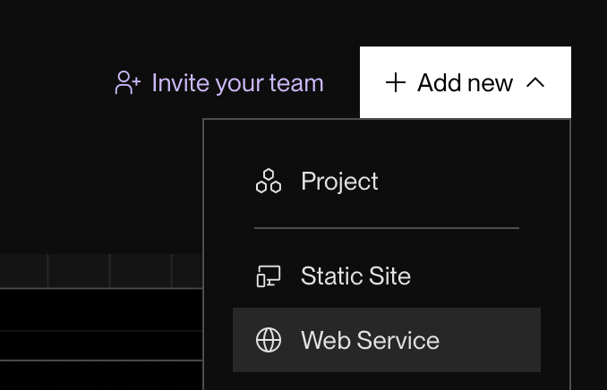
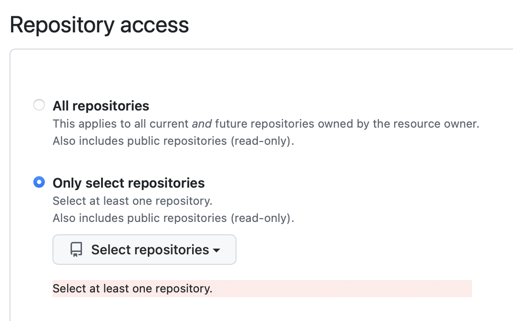
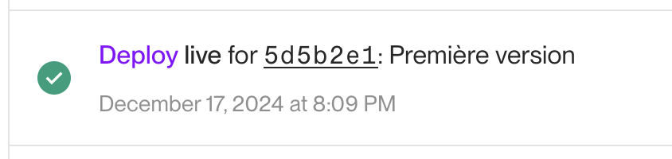
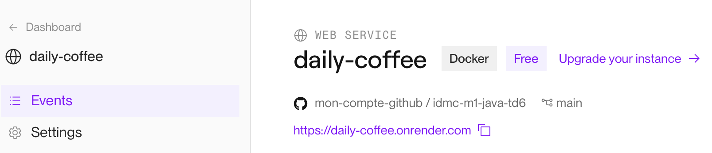

# TD n°6 - Documentation

Dans ce TD, nous allons nous intéresser à la documentation sous toutes ses formes.
Vous allez pour cela travailler par groupes de 2.

## Présentation

Quelques exemples de documentations :
* [JDK 24](https://docs.oracle.com/en/java/javase/24/docs/api/index.html)
* [http-server](https://github.com/http-party/http-server)
* [Dropbox](https://www.dropbox.com/developers/documentation/http/documentation#files-list_folder)
* [GitHub](https://docs.github.com/en/rest/quickstart?apiVersion=2022-11-28)
* [Airtable](https://airtable.com/appYPuPlPCUMHnoTt/api/docs) 🔒

## Serveur web basique

Depuis Java 6, le jdk met à disposition des classes permettant de créer
en quelques lignes de codes un serveur http. Depuis Java 9, elles ont été
regroupées dans le module `jdk.httpserver`.

🚧 En vous aidant de [cet article](https://hyperskill.org/learn/step/27737#creating-an-http-server), écrivez un serveur web
qui écoute sur le port 3000 et affiche « Hello world :-) » quand on consulte l'URI "/".
Vérifiez le résultat [en utilisant votre navigateur](http://localhost:3000).

Remarquez que n'importe quelle autre URL interrogée affiche le même message,
et ce malgré l'association explicite du handler à l'url "/". Pourquoi ?
[indice](https://docs.oracle.com/javase/8/docs/jre/api/net/httpserver/spec/com/sun/net/httpserver/HttpServer.html#createContext-java.lang.String-com.sun.net.httpserver.HttpHandler-)

> n'importe quelle URL répond la même chose
> http://localhost:3000/abc/def
> You are here : /abc/def
>
> c'est normal, c'est écrit dans la doc de `createContext()` (ici 👇 la version 24)
> « The path specifies the root URI path for this context. The first character of path must be '/'. »
> « If the path does not end with '/', eg such as with "/foo" then this would match requests with a path of "/foobar" or "/foo/bar". »

## Gestion des 404

🚧 On veut désormais que notre serveur réponde "hello world" uniquement sur le préfixe `/`,
et qu'il renvoie une page html d'erreur dans tous les autres cas (la page `404.html` dans les ressources).
Les handlers étant déjà écrits, vous pourriez sûrement en tirer profit avec le _design pattern_ qui va bien ;-).
Vous aurez sûrement besoin de la méthode `HttpExchange::getRequestURI()`.

## Services

🚧 Nous allons transformer notre page "hello world" en un véritable service REST (i.e. renvoyant des données au format JSON).
Pour cela, nous allons chercher et aggréger des informations de deux webservices publics sur les Internets.

```
     http://xxx         http://yyy     
          ▲                  ▲         
          │                  │         
          │                  │         
  ┌───────┼──────────────────┼───────┐ 
  │  ┌────┴──────┐    ┌──────┴────┐  │ 
  │  │ Service 1 │    │ Service 2 │  │ 
  │  └───────────┘    └───────────┘  │ 
  │                                  │ 
  │         handler de notre         │ 
  │            webservice            │ 
  └──────────────────────────────────┘ 
                                       
```

🚧 Chaque membre de votre binôme va devoir **implémenter et documenter** un des services
en suivant les instructions fournies dans le README du projet correspondant.
Vous vous échangerez ensuite vos livrables pour vérifier la qualité et la pertinence
de la documentation produite.

**Ne vous _spoilez_ pas en allant jeter un oeil à l'autre service ;-)**

[](./service-un/)
[](./service-deux/)

Quand vous aurez fini, revenez ici et continuez à dérouler
les instructions chacun de votre côté.

### Instructions communes

🚧 Complétez la javadoc de `ServiceX`. Gardez en tête que c'est votre binome
qui va l'exploiter pour savoir comment utiliser votre service.
Générez la javadoc et vérifier son contenu.

```bash
$ mvn javadoc:javadoc
# ./target/reports/apidocs
```

💡 Il est possible de documenter le package dans le fichier `package-info.java`.
On y met généralement les informations générales comme le rôle du package.

Les paramètres du constructeur du `record` ne sont pas documentés. Essayez de combler
ce manque en consultant [ce lien](https://stackoverflow.com/questions/67375038/java-records-and-field-comments).

🚧 Générez les livrables (deux `.jar`, un pour le code et l'autre la documentation)
et fournissez les à votre binome. En échange, récupérer ses livrables et
déployez les dans votre repository maven local.

```bash
# construire mes livrables
$ mvn clean package

# installer les livrables de mon binôme
$ mvn deploy:deploy-file \
    -DpomFile=pom.xml \
    -Dfile=xxx.jar \
    -Durl=file:///Users/xxx/.m2/repository
```

💡 Les `.jar` créés avec maven contiennent le `pom.xml` qui a servi
à les construire dans le répertoire `META-INF/maven`.

🚧 Ajoutez le `.jar` à votre projet (dépendance maven), et essayez de l'utiliser.

```java
ServiceX service = new ServiceX()
service.xxx();
```

🚧 Réinstallez le service dans votre repository maven local en ajoutant
cette fois la documentation (`-Djavadoc=...`).

```bash
$ mvn deploy:deploy-file \
    -DpomFile=pom.xml \
    -Dfile=xxx.jar \
    -Djavadoc=xxx-javadoc.jar \
    -Durl=file:///Users/xxx/.m2/repository
```

🚧 Actualisez les dépendances maven et vérifiez que vous avez bien la documentation du service affichée dans votre IDE.
* IntelliJ : Project > [your project name] > right click > Maven > Reimport
* IntelliJ : View > Tool Windows > Maven et cliquer sur la double flèche circulaire
* Eclipse : Clic droit sur le projet, menu « Maven > Update Project... »
* VsCode : Dans l'explorateur, Volet Maven, icône « double flêche » (nécessite l'extension « Maven for Java »)

# Webservice final

En utilisant vos deux services, terminez l'implémentation du `RandomCoffeeHandler`.
Testez le [dans votre navigateur](http://localhost:3000/api/random-coffee) et vérifiez
en utilisant [le swagger](./swagger/) que le résultat est conforme à ce qui est attendu.

💡 Encapsulez **toujours** le code de vos handlers dans un bloc `try {} catch {}`
pour pouvoir capturer et réagir aux exceptions, sinon les erreurs seront « absorbées »
silencieusement par le serveur.

## Bonus 🏆

Nous allons déployer notre projet sur les Internets. Vous aurez besoin pour celà
d'un compte (gratuit) sur [Render.com](https://render.com).

### Création de l'image Docker

Pour déployer notre projet, il faut qu'il soit disponible sous la forme d'une image Docker.
Ajustez l'instruction `COPY` du fichier `Dockerfile` pour l'apdater à votre projet (i.e. ajustez le nom du `.jar`).

```Dockerfile
#                  nom de votre jar ici
#                          v
COPY --from=build /target/xxx.jar webapp.jar
```

💡 Si vous avez Docker installé, vous pouvez tester l'image en local:
```bash
$ docker buildx build -t my-awesome-webapp .
# ou `docker build -t my-awesome-webapp .` pour les versions + anciennes
$ docker run -it --rm -p 3000:3000 my-awesome-webapp:latest
# naviguer vers http://localhost:3000/
```

### Déploiement

Connectez vous à [Render](render.com). Depuis le dashboard, créez un nouveau projet de type "Web Service".


Vous devez ensuite autoriser Render à accéder à votre repository GitHub. Choisissez l'onglet "Git provider",
puis cliquez sur le bouton "Credentials" à droite. Utilisez le menu "Configure in GitHub" pour aller paramétrer l'accès. 


Cliquez ensuite sur le bouton "Connect" en bas de page pour passer à l'étape suivante.
Fournissez les informations obligatoires : le nom du projet (qui servira à construire l'url d'accès)
et le type d'instance (Free = 0$).

Cliquez sur le bouton "Deploy" en bas de page pour lancer le déploiement.
Si tout va bien, vous devriez obtenir le message suivant :


Testez votre serveur en utilisant le lien en haut de page pour y accéder.


Et voilà ! Votre serveur est exposé sur Internet 🎉

💡 Si vous consultez les logs, vous verrez des erreurs de ce genre :
```
java.io.IOException: stream closed
```
qui sont en fait dûes à ça :
```
WARNING: sendResponseHeaders: being invoked with a content length for a HEAD request
```

Render utilise des reqûetes `HEAD` pour vérifier le bon fonctionnement du servive (_health check_)
or notre serveur web étant très basique, il ne gère que les requête `GET`.
On pourrait gérer les requêtes `HEAD` avec quelques lignes de code en plus :
```java
if (("HEAD").equals(t.getRequestMethod())) {
    t.getResponseHeaders().set("Content-Length", ...);
    t.sendResponseHeaders(HttpURLConnection.HTTP_OK, -1 /* no content */);
} else {
    // ...
}
```

💡 Render installe des _hooks_ sur votre repository, ce qui lui permet de surveiller
son évolution, et de lancer un redéploiement automatique à chaque nouveau commit.
C'est ce qu'on appelle du _Continuous Deployment_ (le "CD" dans CI/CD).
